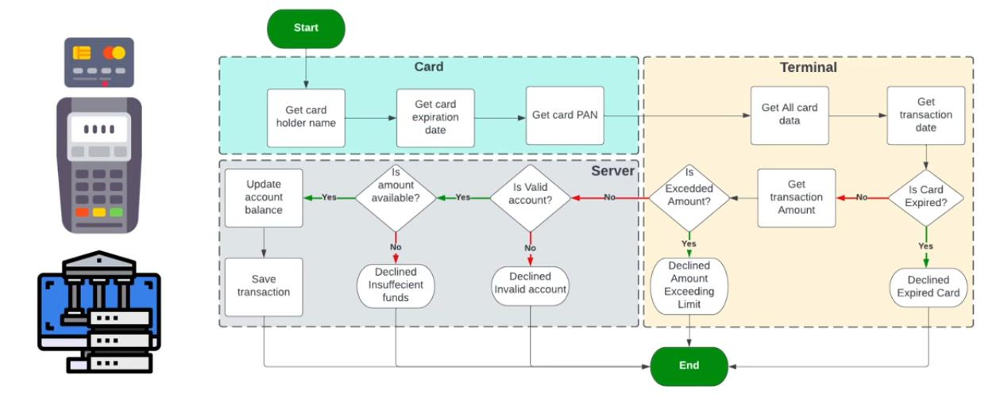
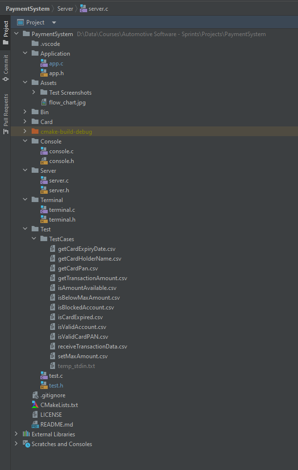

# PaymentSystem-C
Mini Console Payment System made with C


### Sprints - Team 1
- Hossam Elwahsh
- Abdelrahman Walaa Hussein
- Tarek Gohry
- Mahmoud Mowafey
- Mahmoud Matarawy

### Project walkthrough
> https://www.youtube.com/playlist?list=PLQygVO5C3YjjlLX-_xOhRt0-dMKklFDg0

## Design
### Flow Diagram


### Solution Explorer


### Project Tree
```
D:.
│   .gitignore
│   CMakeLists.txt
│   LICENSE
│   README.md
│
├───Application
│       app.c
│       app.h
│
├───Assets
│   │   flow_chart.jpg
│   │   solution_explorer.png
│   │
│   └───Test Screenshots
│           card_h.png
│           terminal_h.png
│           server_h.png
│           console_h.png (helper)
│           app_h.png
|           ------------------------------------
│           card_getCardExiryDateTest_1.png
│           card_getCardExiryDateTest_2.png
│           card_getCardHolderName.jpg
│           card_getCardPan.png
|           ------------------------------------
│           server_isAmountAvailable.png
│           server_isBlockedAccount.png
│           server_isValidAccount.png
│           server_listSavedTransactionsTest.png
│           server_receiveTransactionData_1.png
│           server_receiveTransactionData_2.png
│           server_receiveTransactionData_3.png
│           server_receiveTransactionData_4.png
│           server_saveTransactionTest.png
|           ------------------------------------
│           terminal_getTransactionAmount.png
│           terminal_getTransactionDate.png
│           terminal_isBelowMaxAmountTest_1.png
│           terminal_isBelowMaxAmountTest_2.png
│           terminal_isCardExpired.png
│           terminal_isValidCardPAN.png
│           terminal_setMaxAmount.png
│
├───Bin
│       PaymentSystem.exe
│
├───Card
│       card.c
│       card.h
│
|
├───Console
│       console.c
│       console.h
│
├───Server
│       server.c
│       server.h
│
├───Terminal
│       terminal.c
│       terminal.h
│
└───Test
    │   test.c
    │   test.h
    │
    └───TestCases
            getCardExpiryDate.csv
            getCardHolderName.csv
            getCardPan.csv
            getTransactionAmount.csv
            getTransactionDate.csv
            isAmountAvailable.csv
            isBelowMaxAmount.csv
            isBlockedAccount.csv
            isCardExpired.csv
            isValidAccount.csv
            isValidCardPAN.csv
            receiveTransactionData.csv
            setMaxAmount.csv

```

## More info

### Credit card numbers
This is often referred to as the ‘long number’ on the front of your credit card, which is usually 16 digits, 
but can be up to 19 digits in some instances. More formally, it’s known as a Permanent Account Number, or ‘PAN’.

It’s not just a random number though. Your credit card number is unique to you and includes information
used to identify your account, card and who it’s issued by.

The first digit indicates the provider:

- Mastercard numbers start with a `2` or `5`
- Visa card numbers start with a `4`
- American Express numbers start with a `3`

The first 6 digits help to identify the card issuer, known as an Issue Identifier Number or ‘IIN’.

All numbers following that relate specifically to your account,
excluding the last one which is known as a ‘check digit’. 
This helps us verify that the full credit card number has been provided, and in the right order, 
anytime you make a purchase or payment.

This method for creating credit card numbers is used internationally, 
and was invented by IBM engineer **Hans Peter Luhn** in 1954.

---